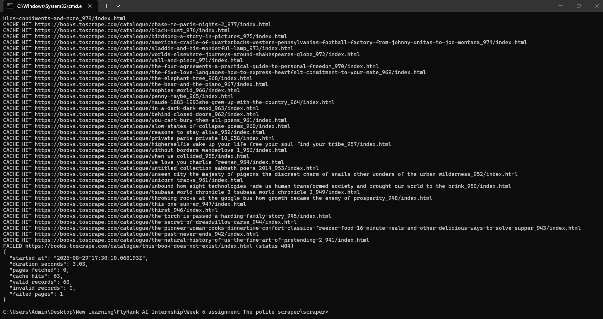

# The Polite Scraper — A9

A small scraping pipeline: fetch → discover → extract → normalize → validate → store → report.
Target: [Books to Scrape](https://books.toscrape.com), a public sandbox built specifically for
practicing scraping.

## Target classification (Stage 0)

- **Site:** books.toscrape.com — the homepage states it is "a website that exists solely
  to be scraped," built by the maintainers of Scrapy for exactly this kind of practice.
- **Scope:** the first 3 catalogue pages only (~60 books), not the whole site.
- **Data collected:** title, price, availability, star rating, description, and the URL/
  timestamp of where each fact came from (provenance) — all publicly visible on the page,
  nothing behind a login.
- **robots.txt result:** `https://books.toscrape.com/robots.txt` returns **404** — no robots
  file found. A missing file is not permission on its own, but combined with the site's own
  "built to be scraped" statement and the sandbox's stated purpose, this target is appropriate
  for this exercise.
- I will not reuse this code on another site without checking its rules and terms first.

## How to run

```bash
cd scraper
pip install -r requirements.txt
python src/main.py
```

Produces `output/books.json`, `output/errors.json`, and `output/run-report.json`.
Re-running is safe — cached pages are read from disk (`cache/`, git-ignored) and `books.json`
stays at 60 unique records, never duplicated.

## Record schema

| Field | Type | Notes |
|---|---|---|
| title | string | |
| product_url | URL | canonical identity of the record |
| price_text | string | raw, e.g. `"£51.77"` |
| price_gbp | number | parsed from price_text |
| availability_text | string | raw stock text |
| rating_text | string \| null | e.g. `"Three"` |
| description | string \| null | null when the book page has none — never invented |
| source_page | string | which catalogue page linked here |
| fetched_at | string (ISO 8601) | when this record was collected |

## Politeness rules followed

- Identifying `User-Agent`: `FlyRankInternshipA9/1.0 (+link to this repo)`
- 10-second timeout on every request — nothing waits forever
- ≥500ms delay between real requests (cached reads add no delay)
- Status code checked before parsing anything; only `200` is treated as a page
- `404` / `403` are never retried; `5xx` and timeouts get one retry
- Development reads from the on-disk `cache/` instead of re-hitting the site

## Failure handling

One deliberately broken URL was added to the list and run — the pipeline logged it as a failed
page, skipped it, and the other 60 good records still made it into `books.json`. See
`output/run-report.json` for the counts from that run.

## Sample run-report.json



## Why no browser was needed

The book data (title, price, description, rating) is already present in the HTML the server
sends back — there's no JavaScript rendering step producing it client-side. A plain HTTP request
gets everything needed, so a full browser (Playwright etc.) would only add cost here with no
benefit.

## Ethics note

Scrape only sandboxes or sites that explicitly allow it, or use an official API when one exists.
Never bypass logins, paywalls, CAPTCHAs, or an explicit block. Collect only the fields actually
needed for the task, identify the bot honestly, and go slow enough that the target never notices
the traffic.

## AI vs me
